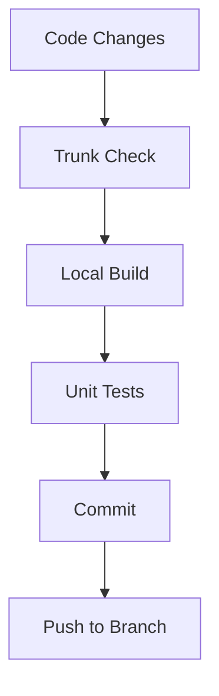
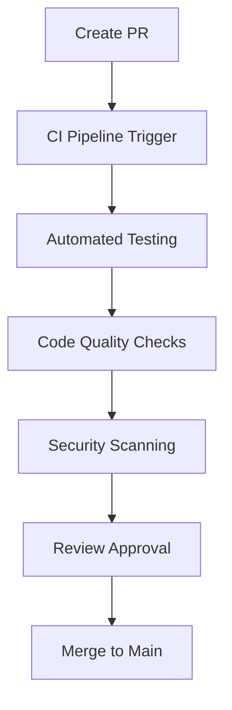
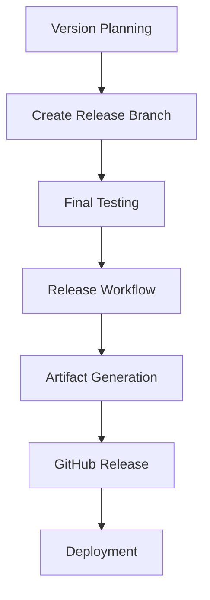

# WileyWidget CI/CD Management Guide

## 📋 Overview

This document provides comprehensive documentation for the WileyWidget project's CI/CD (Continuous Integration/Continuous Deployment) management workflow. The project uses a modern, automated toolchain that ensures code quality, security, and reliable deployments.

## 🏗️ Architecture Overview

### Core Components

```
┌─────────────────┐    ┌─────────────────┐    ┌─────────────────┐
│   Development   │    │      CI/CD      │    │   Deployment    │
│    Environment  │───▶│    Pipeline     │───▶│   Environment  │
└─────────────────┘    └─────────────────┘    └─────────────────┘
         │                       │                       │
         ├─ Local Tools          ├─ GitHub Actions       ├─ Azure Cloud
         ├─ Code Quality         ├─ Automated Testing    ├─ SQL Database
         └─ Version Control      └─ Build Automation     └─ Firewall Mgmt
```

## 🛠️ Tool Ecosystem

### 1. Code Quality & Linting (Trunk)

**Purpose**: Automated code quality enforcement and formatting

#### Configuration

- **File**: `.trunk\trunk.yaml`
- **Version**: 1.25.0
- **Plugins**: Trunk official plugins v1.7.2

#### Active Linters

| Linter             | Version | Purpose                                  |
| ------------------ | ------- | ---------------------------------------- |
| **actionlint**     | 1.7.7   | GitHub Actions workflow validation       |
| **checkov**        | 3.2.467 | Infrastructure as Code security scanning |
| **git-diff-check** | Latest  | Git diff validation                      |
| **markdownlint**   | 0.45.0  | Markdown formatting and style            |
| **prettier**       | 3.6.2   | Code formatting (JavaScript, JSON, etc.) |
| **trufflehog**     | 3.90.5  | Secret detection and prevention          |
| **yamllint**       | 1.37.1  | YAML syntax and style validation         |

#### Runtime Environments

- **Node.js**: 22.16.0 (for JavaScript tools)
- **Python**: 3.10.8 (for Python-based linters)

#### Usage Commands

```bash
# Check all files for issues
trunk check

# Fix auto-fixable issues
trunk fix

# Format code
trunk fmt

# Check specific files
trunk check --files="src/**/*.cs"

# Show available tools
trunk tools
```

### 2. Build Automation (PowerShell Scripts)

#### Core Build Script (`scripts/build.ps1`)

**Purpose**: Complete build, test, and packaging pipeline

**Parameters**:

- `-Config`: Build configuration (Debug/Release) - Default: Release
- `-Publish`: Create deployment packages
- `-SelfContained`: Build self-contained executable
- `-Runtime`: Target runtime (win-x64, etc.)
- `-SkipLicenseCheck`: Bypass Syncfusion license validation
- `-SkipCoverageCheck`: Skip code coverage requirements

**Build Process**:

1. **Pre-build Setup**: Environment preparation, process cleanup
2. **License Check**: Syncfusion license validation
3. **Restore**: NuGet package restoration
4. **Build**: MSBuild compilation with binary logging
5. **Test**: Unit test execution with coverage
6. **Package**: Create deployment artifacts (if requested)

**Usage Examples**:

```powershell
# Standard release build
.\scripts\build.ps1

# Debug build with publishing
.\scripts\build.ps1 -Config Debug -Publish

# Self-contained executable
.\scripts\build.ps1 -Publish -SelfContained -Runtime win-x64
```

#### Specialized Scripts

| Script                        | Purpose                    | Key Features                     |
| ----------------------------- | -------------------------- | -------------------------------- |
| `setup-azure.ps1`             | Azure infrastructure setup | Resource group, SQL DB, firewall |
| `update-firewall-ip.ps1`      | Dynamic IP management      | Auto-detect IP, rule cleanup     |
| `setup-database.ps1`          | Database initialization    | Schema creation, test data       |
| `verify-cicd-tools.ps1`       | Tool validation            | Comprehensive availability check |
| `show-syncfusion-license.ps1` | License management         | Key validation and display       |

### 3. Version Control & Collaboration (Git + GitHub)

#### Branch Strategy

```
main (production)
├── feature/* (feature branches)
├── bugfix/* (bug fixes)
├── hotfix/* (emergency fixes)
└── release/* (release preparation)
```

#### Git Hooks (via Trunk)

- **pre-commit**: Code formatting and basic checks
- **pre-push**: Full linting and test validation
- **commit-msg**: Commit message standards

### 4. CI/CD Pipeline (GitHub Actions)

#### CI Workflow (`ci.yml`)

**Triggers**: Push/PR to main/master branches

**Pipeline Stages**:

1. **Checkout**: Source code retrieval
2. **Cache**: NuGet package caching for performance
3. **Setup**: .NET SDK installation
4. **Build**: Automated build and test execution
5. **Test**: Unit tests with coverage reporting
6. **UI Tests**: Smoke tests for UI components
7. **Artifacts**: Upload test results and coverage reports

**Coverage Requirements**:

- Minimum: 70% line coverage
- Format: Cobertura XML
- Reports: HTML generation with ReportGenerator

#### Release Workflow (`release.yml`)

**Trigger**: Manual workflow dispatch

**Process**:

1. **Version Update**: Update version numbers in build files
2. **Build**: Release configuration compilation
3. **Package**: Self-contained executable creation
4. **Archive**: ZIP package generation
5. **Release**: GitHub release creation with artifacts

**Usage**:

```yaml
# Manual trigger via GitHub UI
# Input: version (e.g., "1.2.3")
```

### 5. Cloud Infrastructure (Azure)

#### Azure Resources

- **Resource Group**: Isolated environment container
- **SQL Database**: Primary data storage
- **Firewall Rules**: Dynamic IP-based access control
- **Application Insights**: Monitoring and telemetry

#### Infrastructure as Code

**Scripts**:

- `setup-azure.ps1`: Complete environment provisioning
- `setup-liberal-firewall.ps1`: Security configuration
- `test-database-connection.ps1`: Connectivity validation

#### Dynamic Firewall Management

**Features**:

- Automatic IP detection
- Rule cleanup (7-day retention)
- Multiple IP support
- Logging and monitoring

**Usage**:

```powershell
# Auto-detect current IP
.\scripts\update-firewall-ip.ps1 -ResourceGroup "rg-name" -SqlServer "server-name" -AutoDetectIP

# Specific IP address
.\scripts\update-firewall-ip.ps1 -ResourceGroup "rg-name" -SqlServer "server-name" -NewIP "1.2.3.4"
```

## 🔄 Development Workflow

### 1. Local Development



### 2. Code Review Process



### 3. Release Process



## 📊 Quality Gates

### Code Quality Metrics

- **Test Coverage**: ≥70% line coverage required
- **Linting**: Zero critical issues allowed
- **Security**: No secrets or vulnerabilities
- **Build**: Successful compilation required

### Automated Checks

| Check Type   | Tool            | Frequency   | Failure Impact |
| ------------ | --------------- | ----------- | -------------- |
| Code Style   | Trunk           | Pre-commit  | Block commit   |
| Security     | TruffleHog      | Pre-push    | Block push     |
| Tests        | MSTest          | CI Pipeline | Block merge    |
| Coverage     | ReportGenerator | CI Pipeline | Block merge    |
| IaC Security | Checkov         | CI Pipeline | Block merge    |

## 🚀 Deployment Strategy

### Environments

1. **Development**: Local development environment
2. **CI**: Automated testing and validation
3. **Staging**: Pre-production validation
4. **Production**: Live environment

### Deployment Automation

- **Blue-Green**: Zero-downtime deployments
- **Rollback**: Automated rollback on failure
- **Monitoring**: Real-time health checks
- **Logging**: Comprehensive audit trails

## 🔧 Maintenance & Operations

### Regular Tasks

- **Tool Updates**: Weekly trunk and dependency updates
- **Security Scans**: Daily secret and vulnerability scans
- **Performance Monitoring**: Continuous performance tracking
- **Backup Validation**: Weekly backup integrity checks

### Troubleshooting

- **Build Failures**: Check `TestResults/msbuild.binlog`
- **Test Failures**: Review `TestResults/*.trx` files
- **Coverage Issues**: Check `CoverageReport/index.html`
- **Azure Issues**: Review firewall rules and connection strings

## 📈 Monitoring & Analytics

### Key Metrics

- **Build Success Rate**: Target >95%
- **Test Pass Rate**: Target >98%
- **Deployment Frequency**: Multiple per day
- **Mean Time to Recovery**: Target <1 hour

### Logging

- **Application Logs**: Structured logging with correlation IDs
- **Build Logs**: MSBuild binary logs for debugging
- **Test Logs**: Detailed test execution reports
- **Security Logs**: Audit trails for all security events

## 🎯 Best Practices

### Development

1. **Always run trunk check** before committing
2. **Write tests** for new features
3. **Use descriptive commit messages**
4. **Keep branches short-lived**
5. **Review code** before merging

### CI/CD

1. **Fail fast** on quality issues
2. **Cache dependencies** for performance
3. **Parallelize** independent jobs
4. **Monitor resource usage**
5. **Automate everything** possible

### Security

1. **Never commit secrets**
2. **Use environment variables** for sensitive data
3. **Regular security scans**
4. **Principle of least privilege**
5. **Audit all access**

## 📚 Reference

### File Structure

```
WileyWidget/
├── .trunk/                 # Code quality configuration
├── .github/
│   └── workflows/          # CI/CD pipeline definitions
├── scripts/                # Automation scripts
├── docs/                   # Documentation
├── WileyWidget/            # Main application
├── WileyWidget.Tests/      # Unit tests
└── WileyWidget.UiTests/    # UI tests
```

### Key Configuration Files

- `.trunk\trunk.yaml`: Code quality configuration
- `Directory.Build.props`: Build properties
- `Directory.Build.targets`: Build targets
- `.env`: Environment variables (local)
- `.gitignore`: Git ignore patterns

### Useful Commands

```bash
# Quality checks
trunk check
trunk fix

# Building
.\scripts\build.ps1
.\scripts\build.ps1 -Publish

# Azure management
.\scripts\setup-azure.ps1
.\scripts\update-firewall-ip.ps1 -AutoDetectIP

# Tool verification
.\scripts\verify-cicd-tools.ps1
```

---

_This document is maintained automatically. Last updated: August 28, 2025_
