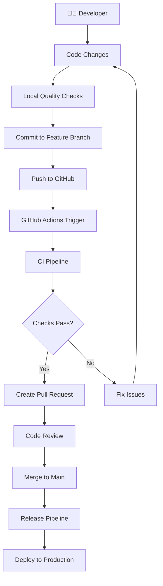
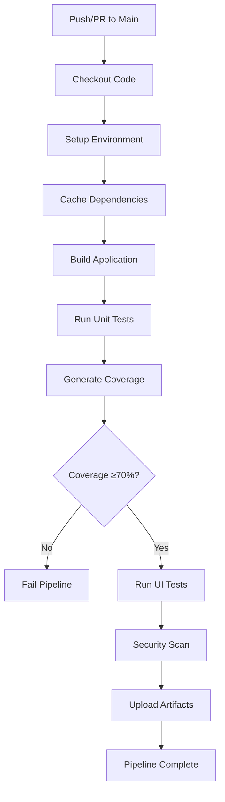
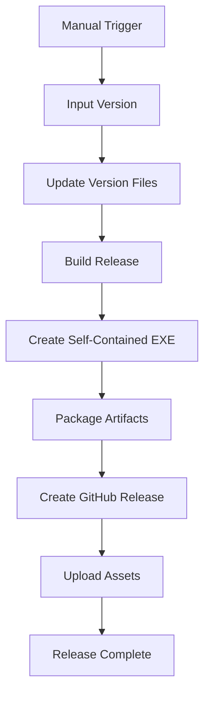
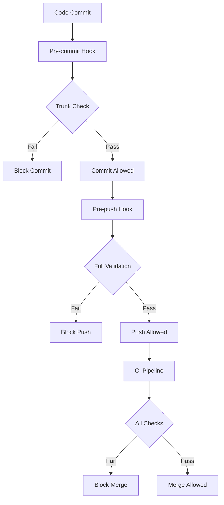
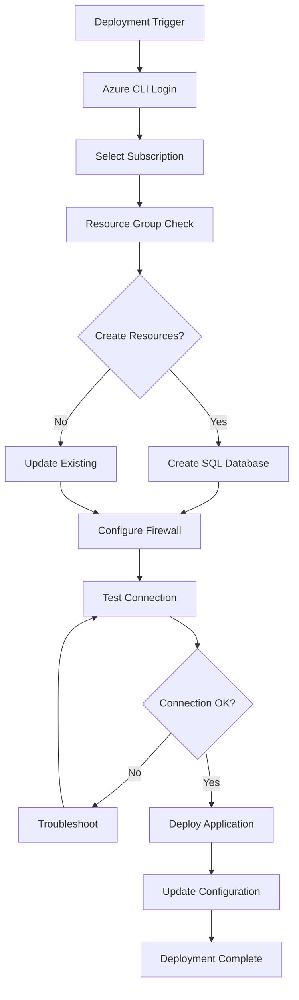
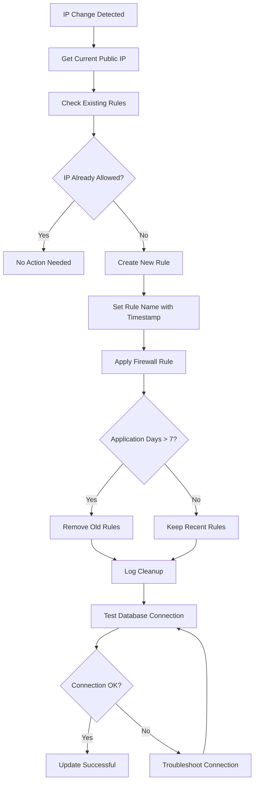
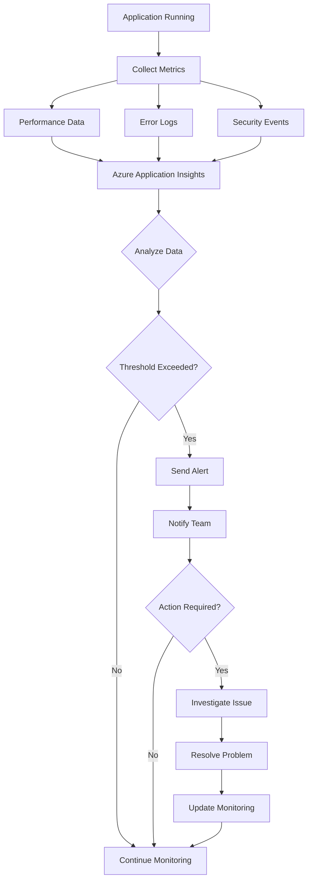
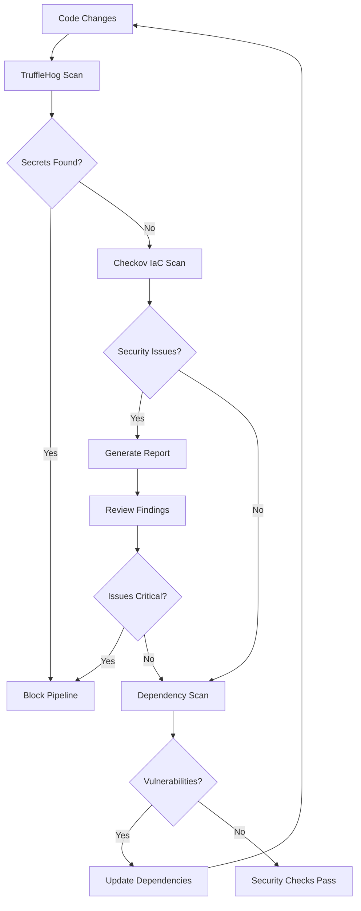

# WileyWidget CI/CD Workflow Diagrams

## 🔄 Complete Development Workflow

## 🏗️ CI Pipeline Flow

## 🚀 Release Pipeline Flow

## 🔧 Quality Gates Flow

## ☁️ Azure Deployment Flow

## 🔄 Dynamic Firewall Management

## 📊 Monitoring & Alerting Flow

## 🔐 Security Scanning Flow

---

## 📈 Key Performance Indicators (KPIs)

### Development Velocity

- **Lead Time**: Time from commit to production
- **Deployment Frequency**: Deployments per day
- **Change Failure Rate**: Failed deployments percentage
- **Mean Time to Recovery**: Time to fix production issues

### Quality Metrics

- **Test Coverage**: Percentage of code covered by tests
- **Build Success Rate**: Percentage of successful builds
- **Security Scan Results**: Number of vulnerabilities found
- **Code Quality Score**: Based on linting results

### Operational Metrics

- **Uptime**: Application availability percentage
- **Performance**: Response times and throughput
- **Error Rate**: Application error percentage
- **Resource Usage**: CPU, memory, and storage utilization

---

_These diagrams provide a visual representation of the CI/CD processes and can be used for training, documentation, and process improvement._
